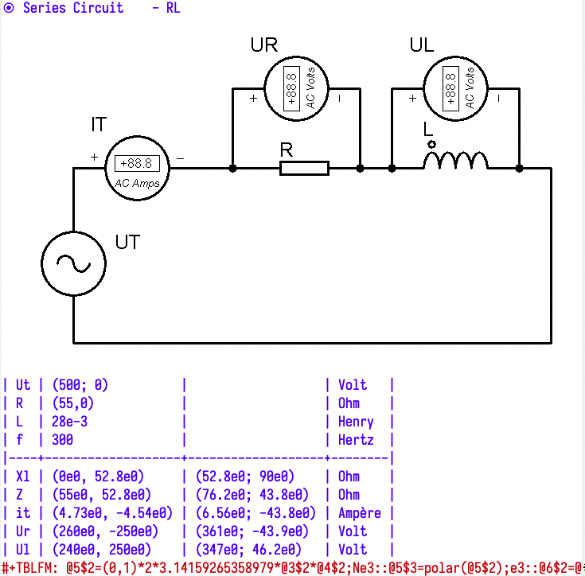

# AC Circuits

It's a .org file you can use within emacs to solve basic monophasic AC circuits

Simple enter circuit basic parameters in the complex form (rectangular or polar) and eval the circuit or the entire file.

You can export it into an html, such as in here: [exported_html](./ac_circuits.html)

Requires: emacs + org-mode + calc (all built-in on modern emacs)

Tested under Linux, Windows and MacOS.

## Features
Allows you to solve for impedance, current and voltage, both on rectangular and polar forms on the following classic circuits:
- Pure Resistive
- Pure Inductive 
- Pure Capacitive
- RL Series
- RC Series
- RLC Series
- RL Parallel
- RC Parallel
- RLC Parallel

## Screenshots

